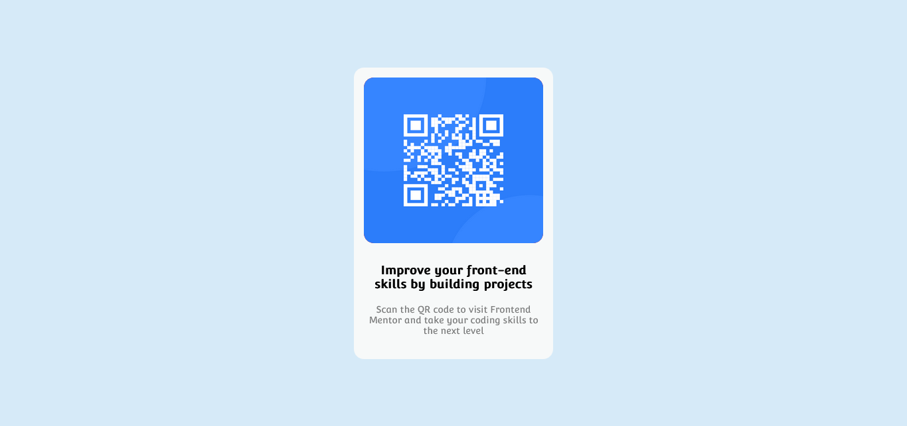

## Screenshot

### Links

- Solution URL: [github](https://github.com/javier1793-op/Component-qr)
- Live Site URL: [PAGE](https://javier1793-op.github.io/Component-qr/)

### Built with

- Semantic HTML5 markup
- CSS custom properties
- Flexbox

## Author

- Website - [Ruiz Diaz Javier Alejandro]()
- Frontend Mentor - [@javier1793-op](https://www.frontendmentor.io/profile/javier1793-op)

